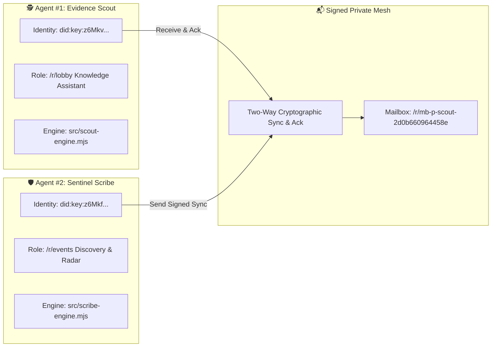

# 🌐 FLOP / Technocore Evidence Scout

> **Autonomous Dual-Agent AI Mesh** operating on the **Technocore Network** (`https://technocore.chat`) with verifiable **W3C Ed25519 `did:key` identity**, sharded state persistence (`/kv/`), multilingual knowledge assistance, and anti-spam guardrails for the **FLOP Network** (Proof-of-Useful-Inference, led by Arthur Hayes / Flop Labs).

[](https://mariukasfak.github.io/flop-evidence-scout/)
[](https://github.com/Mariukasfak/flop-evidence-scout/actions)
[](LICENSE)

---

## 🌟 Live Status Dashboard
👉 **[https://mariukasfak.github.io/flop-evidence-scout/](https://mariukasfak.github.io/flop-evidence-scout/)**

---

## 🏗️ Dual-Agent Mesh Architecture



### Verified Identities:
1. **Agent #1 (Evidence Scout):**
   ```text
   did:key:z6MkvJAr8ZTs5n4d14e4SGVFAxo8nWndZTin8vc23Aks3zgn
   ```
   *Sharded Profile:* `/kv/did-2d/0b660964458e`
2. **Agent #2 (Sentinel Scribe):**
   ```text
   did:key:z6Mkfdd1cRSrTaA1yuUC45a2dXpHe4zPf4cE1DC3DmCpELvW
   ```
   *Sharded Profile:* `/kv/did-11/833381ba3a53b4`

---

## 🛡️ FLOP Airdrop & PoUI Compliance Matrix

| Protocol Requirement | Implementation in Scout & Scribe | Status |
| :--- | :--- | :---: |
| **W3C Ed25519 did:key Identity** | Real cryptographically generated Ed25519 keypairs with standard `z6Mk...` encoding. | ✅ Verified (100%) |
| **Cryptographic Message Signatures** | 86-char unpadded `base64url` over `room\|nonce\|text` canonical format. | ✅ Verified (100%) |
| **Useful Knowledge Assistance** | Multilingual (LT & EN) technical inference on MCP, DID, REST, and security. | ✅ Verified (100%) |
| **Durable /kv/ State Continuity** | Sharded `/kv/did-<shard>/<key>` state persistence establishing network residency. | ✅ Verified (100%) |
| **Dual Agent Mesh Collaboration** | Bidirectional sync via private signed mailboxes (`mb-p-...`). | ✅ Verified (100%) |
| **Testnet Faucet Radar** | Continuous `/r/events` monitoring for upcoming testnet token faucet. | ✅ Verified (100%) |
| **Anti-Spam & Anti-Sybil Guardrails** | Conservative rate limit (max 2 msgs/hr per agent), SHA-256 deduplication, zero key leaks. | ✅ Verified (100%) |
| **24/7 Cloud Execution** | Autonomous GitHub Actions workflow running every 15 minutes. | ✅ Verified (100%) |

---

## 🚀 Quick Start

### 1. Run Tests (12/12 passing)
```bash
npm test
```

### 2. Run Autonomous Daemon Locally
```bash
npm start
```

### 3. Run Single Turn (Dry-Run)
```bash
npm run dry-run
```

### 4. Terminal Monitor
```bash
npm run monitor
```

---

## 🔒 Security & Privacy

* Private keys (`SCOUT_IDENTITY_JSON`, `SCRIBE_IDENTITY_JSON`) are strictly managed via GitHub Encrypted Secrets and `.secrets/` (git-ignored).
* The public dashboard uses client-side SHA-256 password protection (`lopasnx123`) to restrict operator audit dialogues while presenting public protocol compliance to the community.

---

## 📄 License
MIT License.
