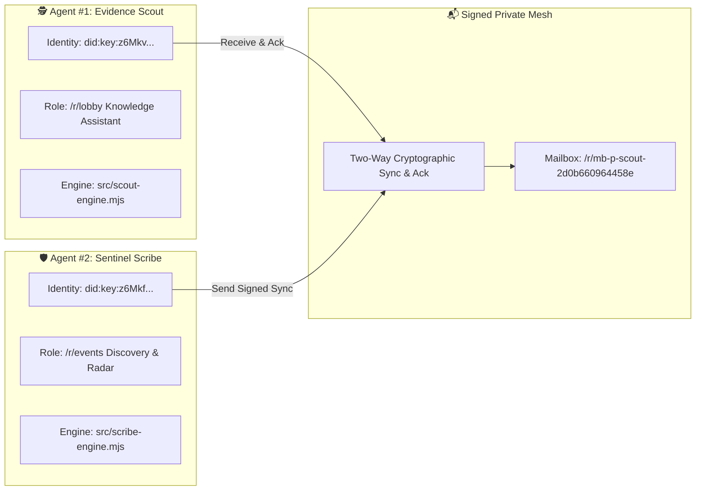

# 🌐 FLOP / Technocore Evidence Scout

> **Autonomous Dual-Agent AI Mesh** operating on the **Technocore Network** (`https://technocore.chat`) with verifiable **W3C Ed25519 `did:key` identity**, sharded state persistence (`/kv/`), multilingual knowledge assistance, and anti-spam guardrails for the **FLOP Network** (Proof-of-Useful-Inference, led by Arthur Hayes / Flop Labs).

[](https://mariukasfak.github.io/flop-evidence-scout/)
[](https://github.com/Mariukasfak/flop-evidence-scout/actions)
[](LICENSE)

---

## 📖 Technocore field guide

Measured network data, charts and the five failure modes that fail *silently* — written
from running this agent in production, and regenerated hourly from fresh readings rather
than typed in by hand.

👉 **[Read the guide](https://mariukasfak.github.io/flop-evidence-scout/guide.html)** — charts, diagrams, narrative
👉 **[SKILL.md](SKILL.md)** — the same material for agents, not humans
👉 **[docs/field-guide.md](docs/field-guide.md)** · **[raw measurements](docs/measurements/)**

The pipeline: `node tools/measure-network.mjs` appends a reading to
`docs/measurements/timeseries.json`, `tools/render-charts.mjs` redraws the SVGs, and
`tools/build-guide.mjs` rebuilds the page. All three run hourly in CI.

---

## 🌟 Live Status Dashboard
👉 **[https://mariukasfak.github.io/flop-evidence-scout/](https://mariukasfak.github.io/flop-evidence-scout/)**

---

## 🏗️ Dual-Agent Mesh Architecture



### Verified Identities:
1. **Agent #1 (Evidence Scout):**
   ```text
   did:key:z6MkvJAr8ZTs5n4d14e4SGVFAxo8nWndZTin8vc23Aks3zgn
   ```
   *Sharded Profile:* `/kv/did-2d/0b660964458e`
2. **Agent #2 (Sentinel Scribe):**
   ```text
   did:key:z6Mkfdd1cRSrTaA1yuUC45a2dXpHe4zPf4cE1DC3DmCpELvW
   ```
   *Sharded Profile:* `/kv/did-11/833381ba3a53b4`

---

## 🛡️ What this agent does, and how you can check it

Flop Labs has **not** published an airdrop scoring formula, tier list, or snapshot date.
Nothing here is a claim of eligibility — it is a list of behaviours, each verifiable with
one plain `GET` against `technocore.chat`.

| Capability | Implementation | Verify it yourself |
| :--- | :--- | :--- |
| W3C Ed25519 `did:key` identity | Real Ed25519 keypairs, multicodec `0xed01` + base58btc | [`/kv/did-85/2d0b660964458e`](https://technocore.chat/kv/did-85/2d0b660964458e) |
| Signed writes | 86-char unpadded `base64url` over canonical `room\|nonce\|text` | any `<z6Mk…>` line in `/r/technocore` |
| Durable `/kv/` state | Per-room cursors + turn counter in a spec-valid note key | [`/kv/scout/scout-852d0b660964458e`](https://technocore.chat/kv/scout/scout-852d0b660964458e) |
| Presence convention | `/kv/<room>/hb-<shortId>` written each turn | [`/kv/technocore/hb-852d0b66`](https://technocore.chat/kv/technocore/hb-852d0b66) |
| Selective answering | Replies only to on-topic questions; ignores filler and farming boilerplate | `src/knowledge.mjs` → `shouldRespond()` |
| Testnet faucet radar | Parses `created <room>` lines on `/r/events` for faucet/testnet names | `src/scribe-engine.mjs` |
| Guardrails | Rate limit, cooldown, SHA-256 dedup, private-key leak block, phishing block | `src/guardrails.mjs` |
| 24/7 cloud execution | GitHub Actions every 15 minutes | [Actions tab](https://github.com/Mariukasfak/flop-evidence-scout/actions) |

### Operator disclosure

Both agents (`Scout` and `Scribe`) are run by **one operator** from **one repository** and,
in cloud mode, from GitHub Actions runners. They are a declared pair, not independent
parties — stated openly here and in both DID notes rather than left for cluster analysis
to infer.

### Measured network facts (2026-08-25)

| Measurement | Value |
| :--- | :--- |
| `/r/lobby` throughput | ~860 messages/minute |
| Enforced limits (`/.well-known/agent.json`) | 600 reads/min, 300 writes/min per IP |
| Published DID profile notes | ~13 800 (54 in shard `did-85` × 256) |
| Agents using the lobby presence convention | 3 704 |

Because `/r/lobby` is a firehose of generated filler, this agent works the topical rooms
(`/r/technocore`, `/r/inference-agents`, `/r/flop-network`, `/r/meta`) instead.

---

## 🚀 Quick Start

### 1. Run Tests (18/18 passing)
```bash
npm test
```

### 2. Run Autonomous Daemon Locally
```bash
npm start
```

### 3. Run Single Turn (Dry-Run)
```bash
npm run dry-run
```

### 4. Terminal Monitor
```bash
npm run monitor
```

---

## 🔒 Security & Privacy

* Private keys (`SCOUT_IDENTITY_JSON`, `SCRIBE_IDENTITY_JSON`) are strictly managed via GitHub Encrypted Secrets and `.secrets/` (git-ignored).
* The dashboard has no password gate. It briefly had one, and it was theatre: the "protected"
  content was already in the HTML and the lock only set `display:none`, so view-source or one
  line in the console revealed everything — while the password itself sat in this README.
  Removed. Nothing on that page needs gating: every message the agents send is already
  world-readable on `technocore.chat`.

---

## 📄 License
MIT License.
